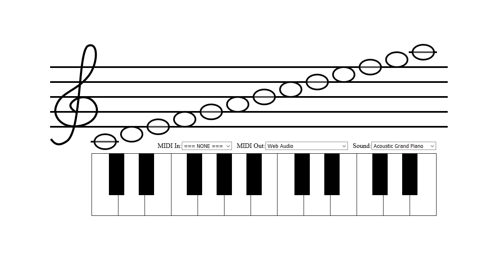

# Interactive Music Staff

Supports mouse, touchscreen, ASCII keyboard, external MIDI instruments.

See it live: https://jazz-soft.github.io/wip/mrfunk

## JavaScript libraries
https://github.com/jazz-soft/JZZ -- MIDI Support  
https://github.com/jazz-soft/JZZ-input-Kbd -- HTML Piano  
https://github.com/jazz-soft/JZZ-synth-Tiny -- Web Audio Synth  
https://github.com/jazz-soft/JZZ-midi-GM -- General MIDI Instrument Names  

## Developer website
https://jazz-soft.net

